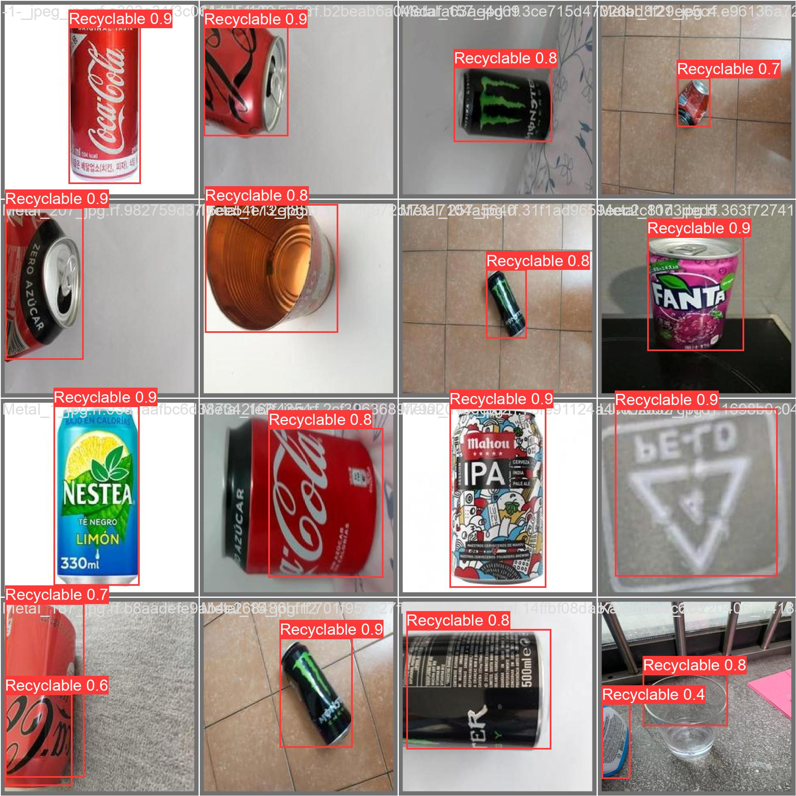

# YOLOv8 Trash Object Detection

This project focuses on automated detection of trash objects using deep learning with YOLOv8. It demonstrates a complete end-to-end computer vision pipeline, from dataset preparation to model training, inference, and output visualization.

---

## 🔍 Problem Statement
Proper waste management and segregation is crucial for environmental sustainability. Manual monitoring of trash in public spaces is inefficient and labor-intensive. This project aims to build an automated system to detect and classify different types of trash in images using YOLOv8 object detection.

---

## 🗄 Dataset & Preprocessing

- **Dataset:** Custom trash images dataset obtained from [Kaggle Trash YOLO Dataset](https://www.kaggle.com/datasets/fatemarahmanqueen/trash-yolo2).  
- **Classes:** Multiple trash categories (e.g., plastic, metal, paper, glass, organic).  
- **Image Preprocessing:** Images resized to 640x640 pixels, normalized, and formatted for YOLOv8.  
- **Data Augmentation:** Mosaic augmentation, random flips, scaling, and rotations to increase variability and improve generalization.  
- **Train/Validation Split:** Configured in `data.yaml` file (commonly 80% training, 20% validation).

---

## 🧠 Methodology

The YOLOv8 Nano model (`yolov8n.pt`) is used as a base and fine-tuned on the trash dataset. Training parameters include:

- Optimizer: **SGD**  
- Learning rate: 0.0001  
- Momentum: 0.9  
- Batch size: 32  
- Epochs: 30  
- Warmup: 5 epochs  

The model outputs bounding boxes, class predictions, and confidence scores for detected objects. Training plots and metrics are saved automatically in `runs/detect/train/`.

---

## 📊 Model Results

The `best.pt` model achieved the highest performance during training. Example output results are shown below:

  
  


> Bounding boxes and class labels are overlaid on images to indicate detected trash objects.

---

## 🔧 Fine-Tuning Strategy

- YOLOv8 Nano pretrained weights were used as the base model.  
- The learning rate and momentum were adjusted to optimize convergence.  
- Mosaic augmentation was used during early epochs and gradually reduced to improve generalization.  
- Weighted losses for bounding boxes, classes, and distribution focal loss were applied to balance detection accuracy.

---

## 🌍 External Validation & Visualization

- The trained model can be evaluated on **new images or videos** to test generalization.  
- Inference results are saved in `runs/detect/predict/`.  
- Annotated output images allow visual validation of detection performance.

---

## 🧪 Evaluation

Model performance can be analyzed using:

- Bounding box accuracy (IoU)  
- Precision, recall, and mAP (mean Average Precision)  
- Confusion matrix for class detection  
- Visualization of predicted bounding boxes on images  

All utilities are integrated into `detect.py` and `train.py` scripts.

---

## 🚀 How to Run

Follow these steps to set up and run the project:

### 1. Clone the Repository
```bash
git clone https://github.com/frqueen/YOLOv8_Trash_Object_Detection.git
cd YOLOv8-Trash-Object-Detection
